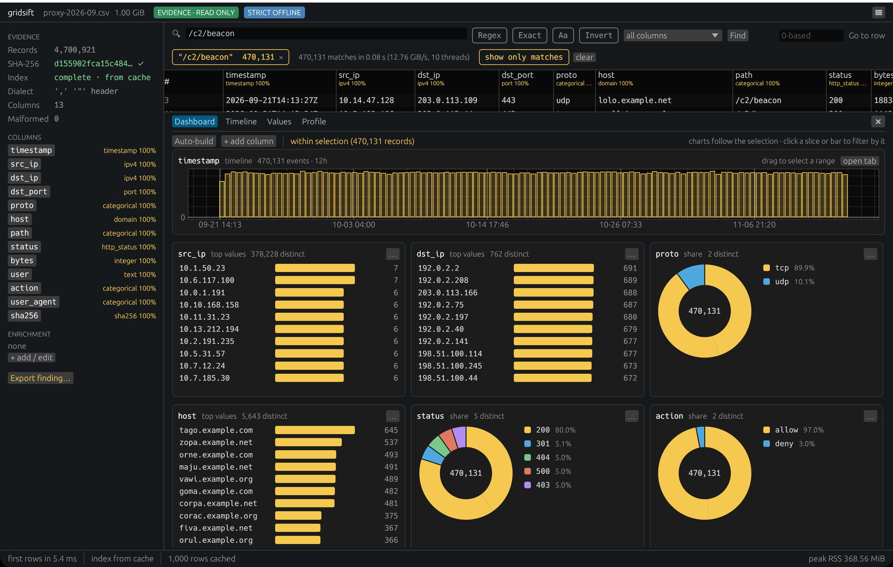
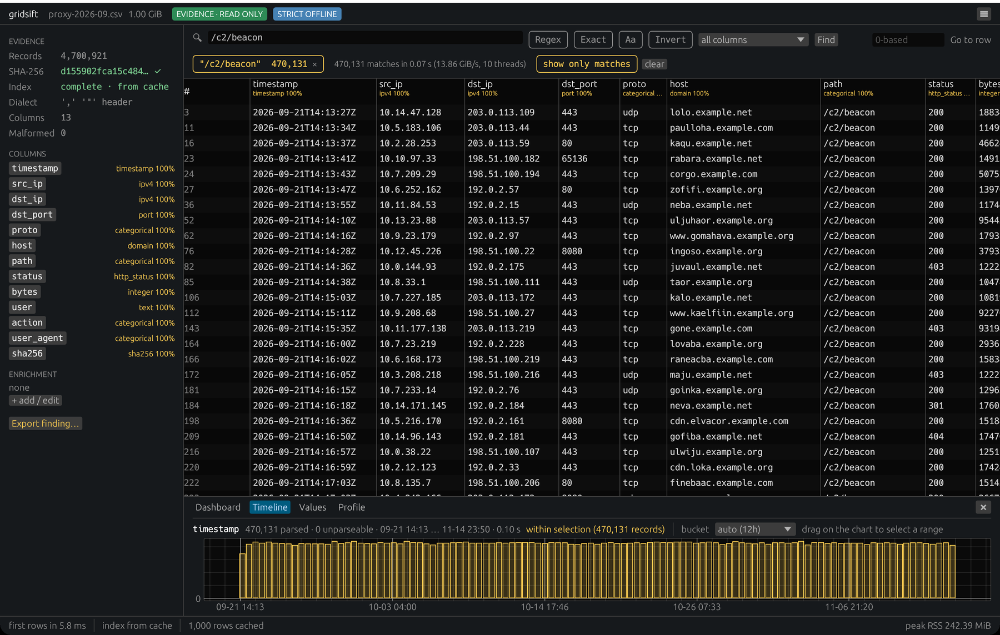
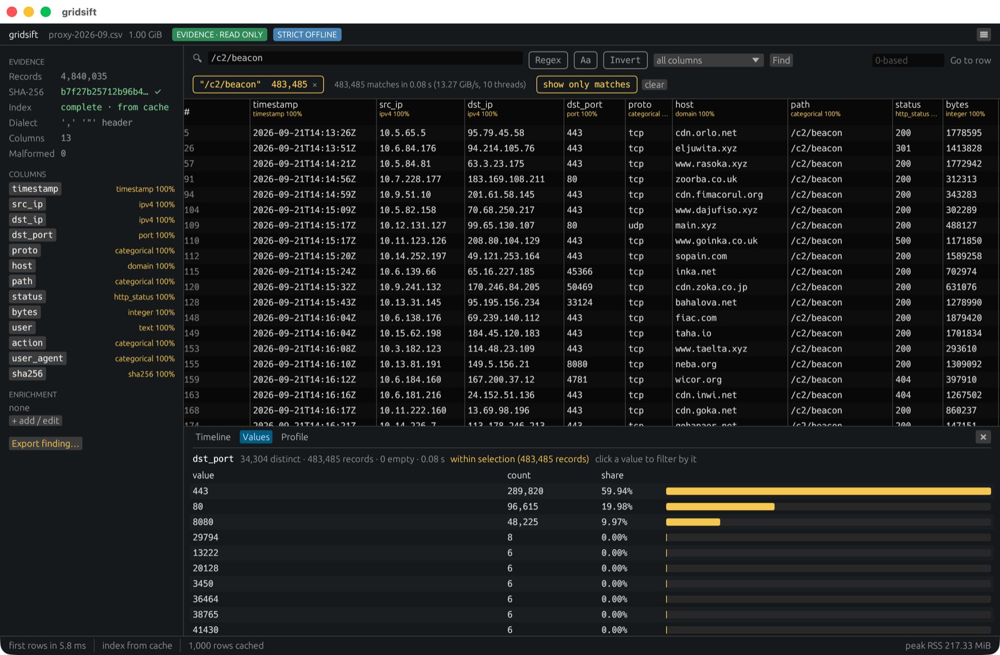
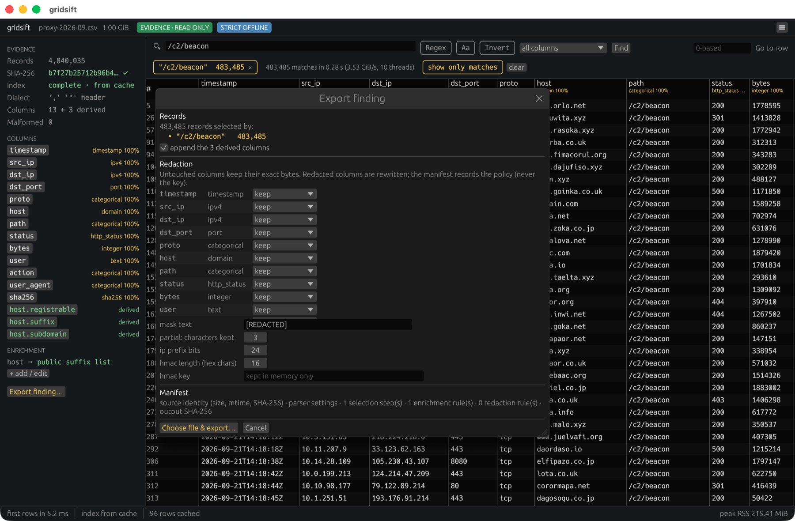
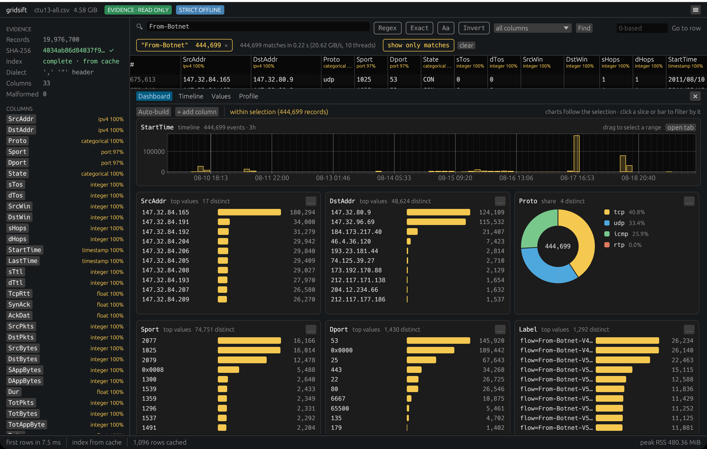

# gridsift

[](https://github.com/uky007/GridSift/actions/workflows/ci.yml)
[](#license)
[](https://www.rust-lang.org)

An offline, evidence-safe workbench for investigating multi-gigabyte CSV
security data — without loading it into RAM, uploading it anywhere, or
modifying the source. Written in Rust; command-line tool and desktop
application for Linux, macOS and Windows.

> Status: pre-release, under active development. Interfaces and the
> manifest format may still change before 1.0.

## Concept

- **Evidence-safe** -- The source is opened read-only and never rewritten.
  Its SHA-256 is computed on open; every derived artefact is tied to it.
- **Bounded memory** -- The source never has to be held in RAM as a
  whole: a sparse, quote-aware record index (a few KiB per GiB) plus fixed
  read buffers is what navigation needs, so the index pass runs in the same
  ~35 MiB at 1 GiB and at 10 GiB. Match sets and lookup tables grow with
  the matches and the tables, not with the file (measured operations and
  conditions in [bench/README.md](bench/README.md)).
- **Strictly offline** -- No telemetry, no update checks, no DNS.
  Enrichment (GeoIP / ASN, domain classification, lookups) uses only local
  datasets the analyst imports, each identified by hash.
- **Reproducible** -- Every filter, time range, enrichment and redaction is
  recorded in a provenance manifest next to the export; `gridsift verify`
  checks it later.

## Interfaces

| Interface | Binary | Description |
|-----------|--------|-------------|
| **Desktop** | `gridsift-desktop` | The interactive investigation: instant rows, search and pivot with a visible selection lineage, value counts, dashboard and timeline, enrichment, export with redaction. |
| **CLI** | `gridsift` | Index, search, count, timeline, profile, export, verify; `--json` on every command for scripting and batch use. |

Both binaries come from the one `gridsift` package; the desktop application
is what `cargo run` starts.

## Quick install

Rust 1.88 or newer. From crates.io, one package installs both binaries:

```
cargo install gridsift --locked    # gridsift-desktop and gridsift
```

Or build from source:

```
git clone https://github.com/uky007/GridSift.git
cd GridSift
cargo build --release
./target/release/gridsift --help
./target/release/gridsift-desktop
```

See [docs/installation.md](docs/installation.md) for Linux build
dependencies, the `dist` profile and where the index cache lives.

## Quick usage

The examples use a synthetic proxy log made by the tool itself (the `demo`
profile only uses hosts under the IANA-reserved `example.com` / `.net` / `.org` and TEST-NET addresses, so
nothing in it is a real host or incident), in a scratch directory that
the repository ignores:

```
export PATH="$PWD/target/release:$PATH"
mkdir -p demo && cd demo
gridsift gen  --profile demo --size 200M -o proxy.csv   # synthetic proxy log, seed 1
gridsift info proxy.csv                                  # dialect + first rows, no scan
gridsift index proxy.csv                                 # sparse index + SHA-256, one pass
gridsift search proxy.csv '/c2/beacon' -c path -n 5      # literal, one column, all cores
gridsift search proxy.csv -r 'deny,"curl/[0-9.]+"'       # regex
gridsift freq proxy.csv -c dst_port -s '/c2/beacon'      # top values over the matches
gridsift timeline proxy.csv -c timestamp -b 1h           # records per hour
gridsift profile proxy.csv                               # ipv4, domain, sha256, timestamp, …
gridsift export proxy.csv -o beacon.csv -s '/c2/beacon' -c path --domain host
gridsift verify beacon.csv                               # re-hash output and source against the manifest
```

```
gridsift-desktop proxy.csv                               # or drag & drop onto the window
gridsift-desktop proxy.csv --search '/c2/beacon' --dashboard
```

Redaction with a key (`--redact user=hmac --hmac-key-file KEY`) is shown
in [docs/usage.md](docs/usage.md); keep the key outside the repository
(`*.key` is ignored) and never in the manifest, which records only its
fingerprint.

See [docs/usage.md](docs/usage.md) for every option, `jq` recipes and the
desktop walkthrough.

## Key features

- **Instant open** -- rows on screen in milliseconds; the index and the
  SHA-256 are built in one background pass (~1 s per GiB warm).
- **Quote-aware sparse index** -- checkpoints carry parser state, so
  multi-line quoted fields are records, any record is one bounded read
  away, and scans run on all cores over disjoint ranges.
- **Search** -- literal, regex or exact field value, per column,
  case-insensitive, inverted; 2–13 GiB/s on a 10-core laptop with a warm
  cache; results are a compressed bitmap of records.
- **Selection lineage** -- a search within a search within a time range:
  each step is a chip with its count, revertable without rescanning, and
  exactly what the manifest records.
- **Dashboard** -- charts picked from what the columns hold: a timeline for
  the timestamp column, pies for protocol / action / status, top-value
  bars for hosts, addresses and ports. They follow the current selection,
  and a click on a slice or bar of a source column is the next selection
  step; derived enrichment columns are counted only.
- **Value counts and timeline** -- top-N per column (exact, then lossy with
  a stated bound), records per time bucket with drag-to-select ranges.
- **Semantic typing** -- columns labelled ipv4, domain, sha256, timestamp,
  port, … with confidence; annotations only, values are never converted.
- **Offline enrichment** -- GeoIP / ASN from an imported MMDB, registrable
  domain from the bundled Public Suffix List, joins against local CSVs;
  derived columns in the grid, in counts and in exports.
- **Edits as an overlay** -- change cells and mark rows in the grid; saved
  as named versions with the case, never into the source; an export can
  apply them and its manifest lists every change.
- **Export with redaction** -- exact source bytes per record, or drop /
  mask / partial / ip-prefix / HMAC-pseudonymised columns; the policy (never
  the key) goes into the manifest.
- **Provenance manifest** -- source identity, parser settings, every
  operation, output digest; written before the output it describes and
  checked by `gridsift verify` ([docs/manifest.md](docs/manifest.md)).
- **Evidence protection by construction** -- every path the tool writes
  (output, manifest, index sidecar, their temporaries) is checked against
  the source first; a source that changes on disk after it was opened is
  detected and blocks exports.
- **Honest numbers** -- elapsed time, throughput and peak RSS on every
  command; approximate results say so.

## Screenshots

The first four screenshots show synthetic data from `gridsift gen`: the
hosts, addresses, users and `/c2/beacon` paths are generated, and no real
incident, host or indicator appears in them. The last one shows public
research data that stays under its own licence.

### Dashboard: charts built from the column types, following the selection



### Desktop: search, lineage, timeline



### Value counts within the selection



### Export finding: lineage, redaction, manifest



### On real traffic: the thirteen CTU-13 botnet captures as one 4.9 GB file

Twenty million labelled flows from the CTU-13 dataset (Stratosphere
Laboratory, Czech Technical University in Prague; [CC BY 2.0](https://creativecommons.org/licenses/by/2.0/),
García et al. 2014), with the `From-Botnet` flows selected and the charts
following the selection. The addresses are the dataset's own, and the data
in this image stays under the dataset's licence, not the project's (see
[NOTICE](NOTICE)). The investigation with its known answers is in
[docs/demo.md](docs/demo.md).



## Exit codes

| Code | Meaning |
|------|---------|
| 0 | Success |
| 1 | Error while running (input not found or unreadable, refused write, index or scan failure) — for `verify`, a digest mismatch or a required source that is missing |
| 2 | Command-line usage error (unknown option, missing argument), reported by the argument parser |

## Docs

- [Why gridsift exists — the problem, who it is for, how it is used](docs/motivation.md)
- [Description & feature list](docs/description.md)
- [Installation](docs/installation.md)
- [Usage & examples](docs/usage.md)
- [Demo on real traffic (CTU-13), with known answers](docs/demo.md)
- [The provenance manifest](docs/manifest.md)
- [Survey of existing tools](docs/survey.md)
- [Roadmap](docs/roadmap.md)
- [Desktop UI design](docs/design/README.md)
- [Benchmarks](bench/README.md)

## License

Dual-licensed under either of

- Apache License, Version 2.0 ([LICENSE-APACHE](LICENSE-APACHE))
- MIT license ([LICENSE-MIT](LICENSE-MIT))

at your option. Third-party licences, and the licence of the dataset shown
in the CTU-13 screenshot, are listed in [NOTICE](NOTICE).
