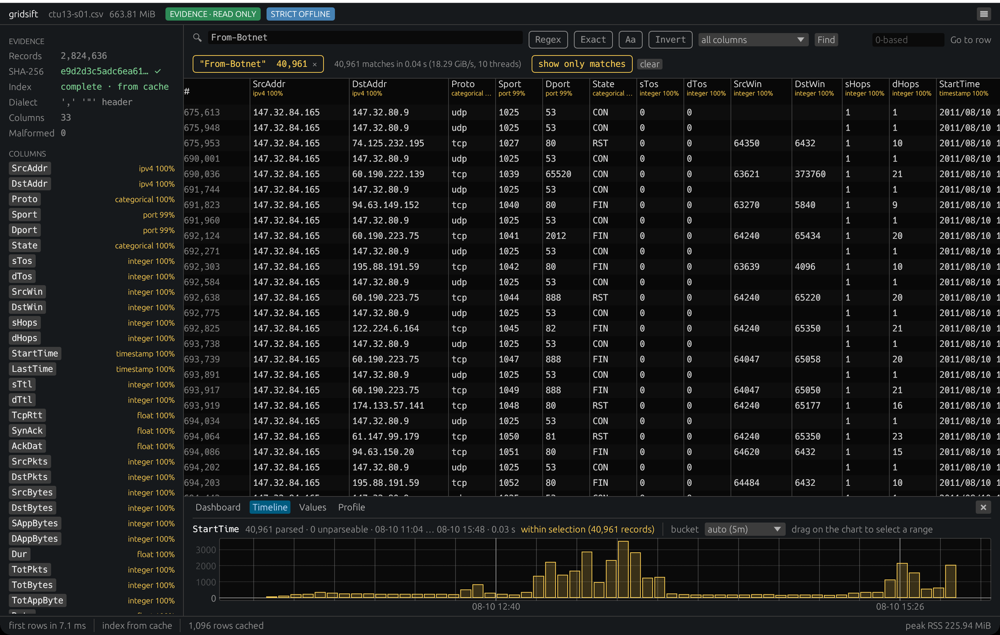

# Demo: a botnet investigation on real traffic (CTU-13)

A 5–10 minute investigation with known answers, on real network flows
rather than synthetic data. Every number below was measured with gridsift
on the files named here and can be reproduced from the commands; the
labels in the dataset are the ground truth.

## The data

**CTU-13** — thirteen botnet captures made at the Czech Technical
University in 2011 (Stratosphere Laboratory). Each scenario ran one
malware sample on a lab host inside the university network while the
router captured everything; the published bidirectional NetFlows carry a
`Label` per flow: *Background*, *Normal*, or *Botnet* (with the botnet
labels naming the traffic kind, e.g. `flow=From-Botnet-V42-TCP-CC`).

- Licence: **CC BY 2.0** (https://creativecommons.org/licenses/by/2.0/), as
  stated in the dataset's README
  (https://mcfp.felk.cvut.cz/publicDatasets/CTU-13-Dataset/README.html).
  The data, and the screenshots of it in this repository, stay under that
  licence; see the NOTICE file. Cite:
  S. García, M. Grill, J. Stiborek, A. Zunino, *An empirical comparison of
  botnet detection methods*, Computers & Security 45 (2014) 100–123.
- Dataset page: https://www.stratosphereips.org/datasets-ctu13 ; files:
  https://mcfp.felk.cvut.cz/publicDatasets/CTU-Malware-Capture-Botnet-NN/
- What to download: only the labelled flow file of each scenario,
  `capture<date>.binetflow.2format` — a plain CSV with a header and 33
  columns (`SrcAddr, DstAddr, Proto, Sport, Dport, State, …, StartTime,
  LastTime, …, TotPkts, TotBytes, …, Label`). **Do not download the
  scenario tarball or `only-exes-of-ctu-13.zip`: they contain the malware
  samples.** The pcaps are not needed either.
- Addresses are real (2011): the infected lab hosts are `147.32.84.x`
  (CVUT), the botnet destinations are wherever the malware talked to
  fifteen years ago. GeoIP / ASN annotations therefore come from a
  *current* database and describe today's allocation of those addresses.

| scenario | directory | malware | flow file | size | duration |
|---:|---|---|---|---:|---|
| 1 | Botnet-42 | Neris | `capture20110810.binetflow.2format` | 696 MB | 6.15 h |
| 2 | Botnet-43 | Neris | `capture20110811.binetflow.2format` | 444 MB | 4.21 h |
| 3 | Botnet-44 | Rbot | `capture20110812.binetflow.2format` | 1,159 MB | 66.85 h |
| 4 | Botnet-45 | Rbot | `capture20110815.binetflow.2format` | 277 MB | 4.21 h |
| 5 | Botnet-46 | Virut | `capture20110815-2.binetflow.2format` | 32 MB | 11.63 h |
| 6 | Botnet-47 | Menti | `capture20110816.binetflow.2format` | 138 MB | 2.18 h |
| 7 | Botnet-48 | Sogou | `capture20110816-2.binetflow.2format` | 28 MB | 0.38 h |
| 8 | Botnet-49 | Murlo | `capture20110816-3.binetflow.2format` | 729 MB | 19.5 h |
| 9 | Botnet-50 | Neris | `capture20110817.binetflow.2format` | 515 MB | 5.18 h |
| 10 | Botnet-51 | Rbot | `capture20110818.binetflow.2format` | 323 MB | 4.75 h |
| 11 | Botnet-52 | Rbot | `capture20110818-2.binetflow.2format` | 26 MB | 0.26 h |
| 12 | Botnet-53 | NSIS.ay | `capture20110819.binetflow.2format` | 81 MB | 1.21 h |
| 13 | Botnet-54 | Virut | `capture20110815-3.binetflow.2format` | 474 MB | 16.36 h |

(Sizes are the HTTP `Content-Length` of each file on 2026-09-30; durations
from the dataset paper.)

### Enrichment data

**DB-IP Lite** (https://db-ip.com/db/lite.php), the September 2026
editions, CC BY 4.0 (https://creativecommons.org/licenses/by/4.0/). DB-IP
asks that results be attributed to DB-IP — a web application links back
from the page that shows them — and suggests the wording *"IP Geolocation
by DB-IP"*. No registration is needed:

| file | size | SHA-256 |
|---|---:|---|
| `dbip-country-lite-2026-09.mmdb` | 8,340,464 | `d284ae2e7427fe33d83465e1506b2b21aae47eb8a9b099f8f4dac6a98c99f041` |
| `dbip-asn-lite-2026-09.mmdb` | 9,511,026 | `ab07c764a10c4f8c2f3539377fa86e5c928243084aafd359d1be4cb8543d7406` |

## Getting the data

Everything goes into the repository's ignored `demo/` directory, and every
command block in this document runs from inside it:

```
export PATH="$PWD/target/release:$PATH"
mkdir -p demo/ctu13 demo/geoip && cd demo

B=https://mcfp.felk.cvut.cz/publicDatasets
# scenario 11 (26 MB) for a rehearsal, scenario 1 (696 MB) for the video …
curl -L -C - -o ctu13/botnet-52.csv $B/CTU-Malware-Capture-Botnet-52/capture20110818-2.binetflow.2format
curl -L -C - -o ctu13/botnet-42.csv $B/CTU-Malware-Capture-Botnet-42/capture20110810.binetflow.2format
# … or all thirteen (4.6 GB): the file name of each is in the table above
for n in 42 43 44 45 46 47 48 49 50 51 52 53 54; do
  f=$(curl -sL $B/CTU-Malware-Capture-Botnet-$n/ | grep -oE 'capture[^"]*\.binetflow\.2format' | head -1)
  curl -L -C - -o ctu13/botnet-$n.csv $B/CTU-Malware-Capture-Botnet-$n/$f
done

curl -L https://download.db-ip.com/free/dbip-country-lite-2026-09.mmdb.gz | gunzip > geoip/dbip-country-lite-2026-09.mmdb
curl -L https://download.db-ip.com/free/dbip-asn-lite-2026-09.mmdb.gz     | gunzip > geoip/dbip-asn-lite-2026-09.mmdb

gridsift hash ctu13/botnet-52.csv     # compare with the table below
```

The server is slow and drops long connections (about 0.5 MB/s in total,
with stalls, on 2026-09-30); `-C -` resumes a partial file, so rerun the
loop until every digest matches.

## Known answers

Measured with gridsift 0.1.0 on all thirteen files (2026-10-01, `main`
at `28cfa35` plus the dashboard heuristics of the following commit). The
record counts are the ones the dataset paper reports for each scenario
and, for scenarios 1, 5, 7 and 11, also the count of Python's `csv` module
on the same file; the botnet / normal counts are the `Label` column of
the published files (the paper's 2014 table differs slightly for some
scenarios because the labels were refined afterwards). Every file parsed
with 0 malformed records and 100 % of timestamps.

| scenario | SHA-256 of the flow file | records | botnet | normal | first … last `StartTime` (as recorded) |
|---:|---|---:|---:|---:|---|
| 1 | `e9d2d3c5adc6ea61e9149fdb12ad49a3aa84d296da9bacd0da07e95a05d43912` | 2,824,636 | 40,961 | 30,258 | 08-10 09:46:53 … 15:54:07 |
| 2 | `1236bb60d922c72e0b002792ce92ab3156dbbdab0765080a16ce86484fd27a8c` | 1,808,122 | 20,941 | 9,082 | 08-11 09:49:35 … 14:01:11 |
| 3 | `3b97733f26890631bbf36a0fb8f92395d6fbb21e7aa5e3e42a97ff5540e389d7` | 4,710,638 | 26,822 | 116,303 | 08-12 15:24:01 … 08-15 10:13:26 |
| 4 | `a8c9c83720ef70e4538bbf42ccee065e580b990215e9bee58866666cbfaf8d83` | 1,121,076 | 2,580 | 25,195 | 08-15 10:42:52 … 15:11:19 |
| 5 | `f6fd1d0fd8e13cbd54a2e8e5235dc6dce0d2beee58b78ce2c176646cf00c3807` | 129,832 | 901 | 4,660 | 08-15 16:43:20 … 17:13:26 |
| 6 | `8110530e87e80d996b7e922b04ceec72e7f8589af91a28662a6a767c90fb5163` | 558,919 | 4,630 | 7,471 | 08-16 10:01:46 … 12:10:56 |
| 7 | `8cc97aaea02190817675ba55eb924eeb7958986790f09f46650d8a360f5723cb` | 114,077 | 63 | 1,669 | 08-16 13:51:24 … 14:12:41 |
| 8 | `f54d2c91da93faf6395777c40cd9b974f52a6e62db470b05583ca41ab04c0147` | 2,954,230 | 6,127 | 72,639 | 08-16 14:18:55 … 08-17 09:47:11 |
| 9 | `306ce0e7ec541012017a879223f8c3b970132767d6cddca60b2f7c465d3f3d9c` | 2,087,508 | 184,987 | 29,893 | 08-17 11:34:49 … 17:12:13 |
| 10 | `786f2a7750074cd3de507bb6ab7431c98e8207529591ae4b8c30ccc67aa8219d` | 1,309,791 | 106,352 | 15,805 | 08-18 09:56:29 … 15:04:59 |
| 11 | `a78e3a297fd07fe4b9a076a93c94b06732679947d96179ebe662cec4339374fc` | 107,251 | 8,164 | 2,709 | 08-18 15:39:35 … 15:55:46 |
| 12 | `d669dbef76f4f45d9e69aab1be1c623d7327c1c765657c60e587df4a36913e21` | 325,471 | 2,168 | 7,615 | 08-19 10:02:43 … 11:45:43 |
| 13 | `10448d328d0b59a60d2ba4c06c26a947bfe6e43d0bdddbcf9b75235d8fb4153a` | 1,925,149 | 40,003 | 31,779 | 08-15 17:13:40 … 08-16 09:36:00 |

`StartTime` in the flow files carries no time zone. gridsift takes naive
timestamps as UTC, so what it displays — and what this table shows — is the
file's value unchanged. The dataset's own scenario READMEs give capture
times in local time (scenario 11's says CEST), so these are not UTC
wall-clock times; a demo that compares them with other clocks must
normalise the zone first.

Scenario 11 (Rbot, 16 minutes) is the quick one for a rehearsal; scenario
1 (Neris, 6 hours, 696 MB) is the one for the video.

### All thirteen in one file

Concatenated in chronological order with a single header — the files
share the header byte for byte — the whole dataset is one 4.9 GB CSV of
nearly twenty million flows over ten days, which is what the "larger than
a spreadsheet, larger than RAM on a small laptop" story needs:

```
( cd ctu13 && { head -1 botnet-42.csv; for n in 42 43 44 45 46 54 47 48 49 50 51 52 53; do tail -n +2 botnet-$n.csv; done; } > ctu13-all.csv )
```

(`botnet-NN.csv` being the thirteen `.binetflow.2format` files named by
their directory number.)

| | |
|---|---|
| size · SHA-256 | 4,922,623,246 bytes · `4034ab86d84037f9b32ebb2f7480d1678e01ecaf326ae106eab3a2a9ce5bb35f` |
| records | 19,976,700 · 0 malformed |
| `index` (sparse index + SHA-256) | 2.27 s · 2,067 MiB/s · peak RSS 35 MiB · sidecar 78 KB |
| `search From-Botnet -c Label` | 444,699 matches · 0.22 s (21 GiB/s, 10 threads) · peak RSS 76 MiB |
| `timeline -c StartTime -b 1d` | 19,976,700 parsed, 0 unparsed · 2011-08-10 09:46:53 … 08-19 11:45:43 · 0.48 s |
| `freq -c DstAddr -s From-Botnet` | 0.19 s · peak RSS 82 MiB · top: 147.32.80.9 (124,109), 147.32.96.69 (115,532), 184.173.217.40 (21,407) |

Machine and conditions: Apple M1 Max (10 cores), 32 GB, internal NVMe,
**warm page cache** (the file had just been written); release build.


## The investigation (command line)

Scenario 11, `demo/ctu13/botnet-52.csv`:

```
gridsift info  ctu13/botnet-52.csv                         # ',' quote '"' header · 33 columns
gridsift index ctu13/botnet-52.csv                         # 107,251 records · 0 malformed · SHA-256 a78e3a29…
gridsift profile ctu13/botnet-52.csv                       # SrcAddr/DstAddr ipv4 · Sport/Dport port · StartTime timestamp · Proto/State/Label categorical
gridsift freq  ctu13/botnet-52.csv -c Label -n 8           # 58 distinct labels; Background-UDP-Established 37,342 on top
gridsift search ctu13/botnet-52.csv From-Botnet -c Label   # 8,164 matches
gridsift search ctu13/botnet-52.csv From-Normal -c Label   # 2,709 matches
gridsift timeline ctu13/botnet-52.csv -c StartTime -b 1m   # 17 one-minute buckets, 100 % parsed
gridsift freq  ctu13/botnet-52.csv -c DstAddr.country -s From-Botnet \
    --geoip DstAddr=geoip/dbip-country-lite-2026-09.mmdb        # CZ 8,155 · US 8 · FR 1
gridsift freq  ctu13/botnet-52.csv -c Dport -s From-Botnet -n 5      # 0x0000 (ICMP) 7,663 · 53 · 123 · 6667 · 80
gridsift export ctu13/botnet-52.csv -o s11-botnet.csv -s From-Botnet -c Label \
    --geoip DstAddr=geoip/dbip-asn-lite-2026-09.mmdb --redact SrcAddr=ip:16
                                                     # 8,164 records · operations: search, enrich, redact
gridsift verify s11-botnet.csv --require-source      # ok · scope output+source
```

What the answers mean: this Rbot sample spent its sixteen minutes
scanning the university's own network (8,143 of its 8,164 flows are ICMP,
almost all to `147.32.0.0/16`, hence *CZ*), with a handful of DNS, NTP,
IRC (6667 — the C&C channel) and HTTP flows. The export carries the ASN of every
destination, the infected host's address truncated to its /16, and a
manifest naming the flow file, the DB-IP database and every step by
hash.

## Scenario 1 in numbers (for the narration)

Neris, 2011-08-10, 09:46–15:54, 2,824,636 flows, 40,961 of them from the
bot (`search From-Botnet -c Label`: 0.05 s). What the bot did, from the
labels and the counts:

| question | command | answer |
|---|---|---|
| what kinds of traffic | `freq -c Label -s From-Botnet` | UDP DNS 26,140 · TCP spam attempts 8,105 · failed DNS 3,057 · TCP attempts 1,881 · HTTP ad clicks 352 · SMTP via private proxy 320 |
| which ports | `freq -c Dport -s From-Botnet` | 53 (DNS) 29,197 · 25 (SMTP) 8,105 · 80 1,243 · **6667 (IRC C&C) 974** · 4506 827 |
| where to | `freq -c DstAddr -s From-Botnet` | 147.32.80.9 (the university resolver) 7,420 · 194.85.105.17 1,160 · 193.232.128.6 1,128 · … |
| which countries | `freq -c DstAddr.country -s From-Botnet --geoip …country…` | RU 13,572 · US 9,720 · CZ 7,631 · DE 1,721 · CA 1,630 · NL 1,491 |
| which networks | `freq -c DstAddr.as_org -s From-Botnet --geoip …asn…` | CESNET 7,562 · MSK-IX 5,476 · Google 2,240 · RU-CENTER 1,674 · Servers.com 1,153 · AFNIC 1,000 |

Read together: a spam bot — thousands of DNS lookups for mail servers,
8,105 SMTP connection attempts, a few hundred HTTP requests to ad
networks, and a thin IRC command channel on 6667. (Country and network are
today's allocation of 2011 addresses.)



## The investigation (desktop, the video)

Scenario 1, `demo/ctu13/botnet-42.csv` (Neris: spam, click fraud and C&C over
six hours):

```
gridsift-desktop ctu13/botnet-42.csv
```

1. **Open.** Rows are on screen at once; the sidebar shows the SHA-256
   arriving and the record count settling; columns are typed (`StartTime`
   timestamp, addresses, ports, `Label` categorical).
2. **Dashboard.** Timeline of six hours; `Label` and `Proto` first (a
   verdict and a protocol column are charted before anything else), then
   top values of `SrcAddr`, `DstAddr`, `Sport`, `Dport`.
3. **Search** `From-Botnet` in `Label`: a chip with 40,961; every chart
   recounts within it. The timeline now shows *when* the bot was active,
   `Dport` shows 53 / 25 / 80 / 6667.
4. **Pivot.** Click `6667` in the `Dport` bars (IRC — the C&C channel): a
   second, exact-match chip with 974 flows; `DstAddr` now lists the C&C
   servers.
5. **Enrich.** *Enrich…* → `DstAddr` → GeoIP with the DB-IP ASN file:
   `DstAddr.asn`, `DstAddr.as_org` appear in green; *Count values* on
   `DstAddr.as_org` shows which networks the bot talked to.
6. **Export finding…** with `SrcAddr` → ip prefix /16 and the derived
   columns included; the dialog lists the two selection steps, the
   enrichment rule and the redaction rule that the manifest will record.
7. **Verify** on the command line: `gridsift verify finding.csv
   --require-source`.

Nothing in these steps modified `botnet-42.csv`; the manifest is the record of
what was derived.

## Notes for the recording

- Show the attribution once: "IP Geolocation by DB-IP", and the CTU-13
  citation.
- The addresses are 2011 addresses: say so when the ASN column appears.
- `Sport` / `Dport` are hexadecimal for ICMP (`0x0000`) and decimal
  otherwise; `Dport` is typed `port` because the header says so.
- `freq`'s `-s` search is over the whole record; restrict with the desktop
  search (column chip) when a column-scoped selection matters.
